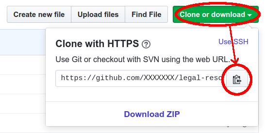
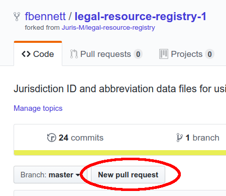

# Jurism: Legal Resource Registry

This repository is one part of the [Jurism](https://juris-m.github.io/downloads) reference manager project, a variant of Zotero that supports legal and multilingual research and writing. As outlined below, jurisdiction and court identifiers are central to the project’s objectives. The notes here are aimed at Jurism users who need to extend or improve jurisdictional coverage. In the instructions that follow the introductory notes below, it is assumed that the reader is comfortable with command-line tools and has a basic familiarity with [JSON syntax](https://en.wikipedia.org/wiki/JSON).

## Contents

* [About legal referencing requirements](#about-legal-referencing-requirements)
* [About machine-readable identifiers](#about-machine-readable-identifiers)
* [Source files and tools](#source-files-and-tools)
   * [Setting up](#setting-up)
   * [Commands](#commands)
   * [File format](#file-format)
      * [Basic form](#basic-form)
      * [Court and jurisdiction](#court-and-jurisdiction)
      * [Courts and sub-jurisdictions](#courts-and-sub-jurisdictions)
      * [Court name selection](#court-name-selection)
      * [Vendor-neutral codes](#vendor-neutral-codes)
      * [Language variants](#language-variants)
      * [Overrides](#overrides)
* [Submitting changes](#submitting-changes)

---------------------

## About legal referencing requirements

By way of background, the special requirements for citation of legal resources have long been a barrier to the development of reference managers capable of handling this category of material. Legal information has a complex structure, and for clarity and accuracy, legal material should be cited in the form familiar to professionals in the target jurisdiction. This clashes with the "one size fits all" citation rules that guides such as MLA, APA, the Chicago Manual of Style apply to (what a lawyer would refer to as) secondary resources.

Properly automating citation forms across multiple jurisdictions requires, in the first instance, a system of machine-readable identifiers for each jurisdiction and (at minimum) the courts within it. These are useful for more than generating citations, of course: a properly composed identifier can concisely express the context of a resource within a hierarchy of authority, which is useful for organizing and interpreting materials.

## About machine-readable identifiers
 
 A standard system of machine-readable jurisdiction/court identifiers does not yet exist, so we are creating one for use in Jurism, loosely based on [a draft “URN:LEX” schema](https://datatracker.ietf.org/doc/draft-spinosa-urn-lex/) proposed to the IETF by Spinosa, Francesconi & Lupo in 2009. While not an official Internet standard, the proposal defines a clear and simple structure for identifers:

``` txt
    jp:fukuoka;hc
```

In the example above:

* `jp` identifies the top level of an independent jurisdiction (Japan in this case);
* `fukuoka` is a jurisdictional subdivision of its parent. Codes for subordinate jurisdictions are connected to their parent with a colon (`:`).
* `hc` is a court identifer (in this case 高等裁判所, or High Court). A court code is connected to its associated jurisdiction with a semicolon (`;`).
* The elements of an identifer must be written in roman characters (including optionally the period (`.`) and tilde (`~`) characters—Latin-1 and other accented or non-roman chararacters are not allowed.

Apart from the constraints listed above, identifiers can be assigned arbitrarily; but once assigned, identifiers should not be changed. Accordingly, if you make local changes to the identifier system following the instructions below, it is important to submit your changes to the Jurism project, so that they can be adopted as a (de facto) standard for all users.

## Source files and tools

Identifiers and abbreviations are closely related. Both are defined in individual country-specific source files held in the [Legal Resource Registry](https://github.com/Juris-M/legal-resource-registry) (LRR), along with software tools used to deploy identifiers and abbreviations into the Jurism client. The LRR content is not shipped with the Jurism desktop client: it must be installed separately to manipulate Jurism’s identifier system. 

To set up for editing the Jurism identifiers, you will need a [GitHub account](https://github.com/), and both [`git`](https://git-scm.com/) and [`nodejs`](https://nodejs.org/en/) must be installed on your local system. With those tools in place, let’s get started …

### Setting up

The first step in setting up is to fork the LRR project to your own GitHub account, by visiting [the LRR project page](https://github.com/Juris-M/legal-resource-registry) and clicking on the **Fork** button:

> 

After forking the project, fetch your project address from your own project page to the clipboard:

> 

Use `git` with the project address to clone the project to a location of your choice:

```bash
    shell> git clone https://github.com/XXXXXXX/legal-resource-registry.git
```

Set the original “upstream” LRR project as a remote partner to your clone. (This makes is possible to keep your clone current with any upstream changes):

```bash
    shell> git remote add upstream https://github.com/Juris-M/legal-resource-registry.git
```

For good measure, issue the command to pull in upstream changes. You should issue this command each time you begin work in the clone, to be sure the upstream project has not changed in the meantime:

```bash
    shell> git pull upstream master
```

Enter the `scripts` subdirectory of the project folder, install dependencies, and link the maintenance script (`jurisupdate`) to your command environment:

```bash
    shell> cd legal-resource-registry/scripts
    shell> npm install
    shell> npm link
```

At this point, running the `jurisupdate` command should yield the following error:

```bash
    shell> jurisupdate
    ERROR: path.dataDir is undefined in /MY/HOME/DIRECTORY/.jurisUpdate
```

The final step in setup is to set several path names in the `.jurisUpdate` configuration
file shown in the error message, using a text editor. The file content will initially look
like this, with `null` values for the paths:

```javascript
{
  "path": {
    "jurisSrcDir": null,
    "jurisMapDir": null,
    "jurisAbbrevsDir": null
  }
}
```

The paths should be set as follows:

> **jurisSrcDir**
> * Set `jurisSrcDir` to the path of the `src` subdirectory of your cloned copy
>   of the LRR.

> **jurisMapDir** and *jurisAbbrevsDir*
> * If these values are left unset, compiled jurisdiction data will be written
>   into the ``juris-map`` and ``juris-abbrevs`` subdirectories of the data directory.
>   This is normally what you want to do.

With these adjustments in place, the `jurisupdate` command should return the following
error message:

```bash
    shell> jurisupdate
    ERROR: One of -a or -j is required.
```

If that all checks out, setup is complete and you’re ready to go.

### Commands

Running the `jurisupdate` command with the `-h` option will show its help text:

```bash
    shell> jurisupdate -h
    Usage: index.js <options>
        -a, --all
           Perform requested operation on all jurisdictions.
        -j <jurisdictionID>, --jurisdiction=<jurisdictionID>
           Perform requested operation on the specified jurisdiction.
        -c, --convert
           Convert from old descriptive format to new descriptive format
        -l, --list
           List codes for all international organizations and countries [with their languages]
        -F --force
           Force overwrite of same data for descriptive-to-compact.
```

To make changes to the Jurism identifier system, you will edit source files in the LRR,
and run the following command to make your changes available when the Jurism client is
(re)started:

```bash
    shell> jurisupdate -a
```

Alternatively, you can limit an update to a particular jurisdiction by setting its code with the `-j` option:

```bash
    shell> jurisupdate -j vn
```

### File format

#### Basic form

Jurisdiction names and abbreviations are stored in ``desc`` files, one per top-level jurisdiction,
with three top-level keys: ``langs``, ``courts``, and ``jurisdictions``. Here is a minimal file,
for a jurisdiction with no courts and only one language:
```javascript
juris-zz-desc.json
{
    "langs": {},
    "courts": {},
    "jurisdictions": {
        "zz": {
            "name": "Atlantis"
        }
    }
}
```

#### Court and jurisdiction

Here is a minimal file for a jurisdiction with one language and just one top-level court.
Note the ``sc`` key shared between ``courts`` and ``jurisdictions.zz.courts``. This
links the court described in the former to the context of the latter.

```javascript
{
    "langs": {},
    "courts": {
        "sc": {
            "name": "Supreme Court"
        }
    },
    "jurisdictions": {
        "zz": {
            "name": "Atlantis",
            "courts": {
                "sc": {}
            }
        }
    }
}
```

#### Courts and sub-jurisdictions

Multiple courts and sub-jurisdictions can be expressed by adding keys
to the ``courts`` and ``jurisdictions`` objects.  In the example
below, note the following:
1. Keys may include a full stop (``.``) as well as lowercase ASCII characters.
2. In ``jurisdictions`` keys, sub-jurisdiction elements are delimited by a colon (``:``).
3. In the ``jurisdictions`` object, sub-jurisdictions should follow their parents.

Also note the following about the use of ``name`` and the ``abbrev``
element introduced in this example:

* In the ``abbrev`` element of a ``courts`` object, a ``%s``
  placeholder may be used. When generating a court abbreviation, the
  placeholder is replaced with the jurisdiction ``abbrev`` (or, if
  that is not available, the jurisdiction ``name``).  In the sample
  below, the abbreviation of ``zz:east;court.appeal`` will be
  *E. Atl. Ct. App.*


* The ``name`` value is used to build menu items in a user
  interface. The court ``name`` should therefore not contain a ``%s``
  placeholder.


```javascript
{
    "langs": {},
    "courts": {
        "sc": {
            "name": "Supreme Court",
            "abbrev": "Sup. Ct."
        },
        "court.appeal": {
            "name": "Court of Appeal",
            "abbrev": "%s Ct. App."
        }
    },
    "jurisdictions": {
        "zz": {
            "name": "Atlantis",
            "courts": {
                "sc": {}
            }
        }
        "zz:east": {
            "name": "East",
            "abbrev": "E. Atl.","
            "courts": {
                "court.appeal": {}
            }
        },
        "zz:west": {
            "name": "West",
            "abbrev": "W. Atl.",
            "courts": {
                "court.appeal": {}
            }
        }
    }
}
```

#### Court name selection

When a court ``abbrev`` contains a ``%s`` placeholder, the jurisdiction portion
can be omitted from the composed court abbreviation by setting an ``abbrev_select``
element under the court in jurisdiction context, with a value of ``court``. Alternatively,
the jurisdiction name can be used in lieu of the court name by setting the value to
``jurisdiction``.

With the sample below (illustrating a federal jurisdiction):
* ``zz:sc`` →  *Atlantis*.
* ``zz:ag`` → *Att'y Gen.*.
* ``zz:lilliput:sc`` → *Lilliputian Sup. Ct.*


```javascript
{
    "langs": {},
    "courts": {
        "sc": {
            "name": "Supreme Court",
            "abbrev": "%s Sup. Ct."
        },
        "ag": {
            "name": "Attorney General",
            "abbrev": "%s Att'y Gen."
        }
    },
    "jurisdictions": {
        "zz": {
            "name": "Atlantis",
            "courts": {
                "sc": {
                    "abbrev_select": "jurisdiction"
                },
                "ag": {
                    "abbrev_select": "court"
                }
            }
        }
        "zz:lilliput": {
            "name": "Lilliput",
            "abbrev": "Lilliputian",
            "courts": {
                "sc": {},
                "ag": {}
            }
        },
        "zz:brobdingnag": {
            "name": "Brobdingnag",
            "abbrev": "Brobdingnagian",
            "courts": {
                "sc": {},
                "ag": {}
            }
        }
    }
}
```

#### Vendor-neutral codes

In the citation forms of some systems specify a special code to
represent a court in vendor-neutral citations. These are represented
with all-caps ``ABBREV`` elements, which apply the same composition
logic as ``abbrev``.

With the sample below, the code for the Atlantis Supreme Court will be
*SC*, and the codes for the Eastern and Western Courts of
Appeal will be *ECA* and *WCA* respectively.

```javascript
{
    "langs": {},
    "courts": {
        "sc": {
            "name": "Supreme Court",
            "ABBREV": "SC"
        },
        "court.appeal": {
            "name": "Court of Appeal",
            "ABBREV": "%sCA"
        }
    },
    "jurisdictions": {
        "zz": {
            "name": "Atlantis",
            "courts": {
                "sc": {}
            }
        }
        "zz:east": {
            "name": "East",
            "ABBREV": "E","
            "courts": {
                "court.appeal": {}
            }
        },
        "zz:west": {
            "name": "West",
            "ABBREV": "W",
            "courts": {
                "court.appeal": {}
            }
        }
    }
}
```

#### Language variants

Language variants can be set by adding a ``variants`` object to a
court, jurisdiction, or court-in-jurisdiction object, with language
codes or nicknames as keys. The object set under each language key may
contain ``name``, ``abbrev``, ``ABBREV``, and ``abbrev_select``
elements, which override those of the default language.

The use of language variants in compiled output is controlled by flags
set against the language code under the ``langs`` element.  Output is
of two types: user-interface data (``ui``), and citation-abbreviation
data (``abbrevs``). Each will be generated only when the relevant flag
is set. Otherwise the default values will be used.

The (purely hypothetical) sample below sets Sudanese court names as a
variant. The following abbreviations would be generated in that language
domain:
* ``zz;sc`` → *Mahkamah Agung*
* ``zz:east;ca`` → **Pangadilan Banding Atl. W.*
* ``zz:west;ca`` → **Pangadilan Banding Atl. K.*

With this sample, user-interface data would be compiled exclusively in
the default language, English. Adding ``ui`` to the ``langs.sd`` array
would include a Sudanese variant in user-interface data.

(Note that in this case the variant of the Supreme Court entry could
equally well be set on the ``courts.sc`` object—and actually should be
set there, for clarity.)

```javascript
{
    "langs": {
        "sd": [
            "abbrevs"
        ]
    },
    "courts": {
        "sc": {
            "name": "Supreme Court",
            "abbrev": "Sup. Ct."
        },
        "court.appeal": {
            "name": "Court of Appeal",
            "abbrev": "%s Ct. App.",
            "variants": {
                "sd": {
                    "name": "Pangadilan Banding %s"
                }
            }
        }
    },
    "jurisdictions": {
        "zz": {
            "name": "Atlantis",
            "courts": {
                "sc": {
                    "variants": {
                        "sd": {
                            "name": "Mahkamah Agung",
                            "abbrev": "Mahkamah Agung"
                        }
                    }
                }
            }
        }
        "zz:east": {
            "name": "East",
            "abbrev": "E. Atl.","
            "courts": {
                "court.appeal": {}
            },
            "variants": {
                "sd": {
                    "name": "Wétan"
                    "abbrev": "Atl. W."
                }
            }
        },
        "zz:west": {
            "name": "West",
            "abbrev": "W. Atl.",
            "courts": {
                "court.appeal": {}
            }
            "variants": {
                "sd": {
                    "name": "Kulon",
                    "abbrev": "Atl. K."
                }
            }
        }
    }
}
```


#### Overrides

Where the UI name or citation abbreviation of a court varies from the
general pattern set for it under ``courts``, a specific override can
be set for it in the specific jurisdiction context that requires bespoke
treatment.

With the sample below, the following abbreviations would be generated:
* ``zz:east;ca`` → *E. Ct. App.*
* ``zz:west;ca`` → *W. Ct. Err.*

```javascript
{
    "langs": {},
    "courts": {
        "sc": {
            "name": "Supreme Court"
        },
        "court.appeal": {
            "name": "Court of Appeal",
            "abbrev": "%s Ct. App."
        }
    },
    "jurisdictions": {
        "zz": {
            "name": "Atlantis",
            "courts": {
                "sc": {}
            }
        }
        "zz:east": {
            "name": "East",
            "abbrev": "E.","
            "courts": {
                "court.appeal": {}
            }
        },
        "zz:west": {
            "name": "West",
            "abbrev": "W.",
            "courts": {
                "court.appeal": {
				    "name": "Court of Error",
					"abbrev": "%s Ct. Err"
				}
            }
        }
    }
}
```

## Submitting changes

If you have written your changes into a `git` clone of the Legal Resource
Registry as described in the [Setting up](#setting-up) section above, you
can submit your changes for general use by pushing them to your GitHub
account, and then filing a “pull request” to invite their adoption.
The first step is a one-liner at the command line (possibly followed by
entry of your GitHub user ID and password):

```bash
    shell> git commit -m "Update to Atlantis" -a
```

After pushing your changes, visit the Legal Resource Registry project in your GitHub account, and file a pull request:





Follow the instructions to complete the request, and we’ll be in touch!

<br/>
<br/>
— Frank Bennett, Nisshin City near Nagoya, Japan, September 12, 2020
